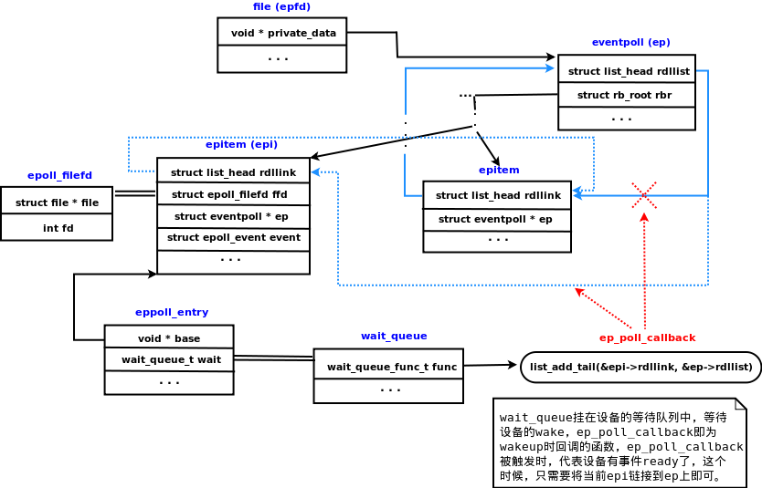
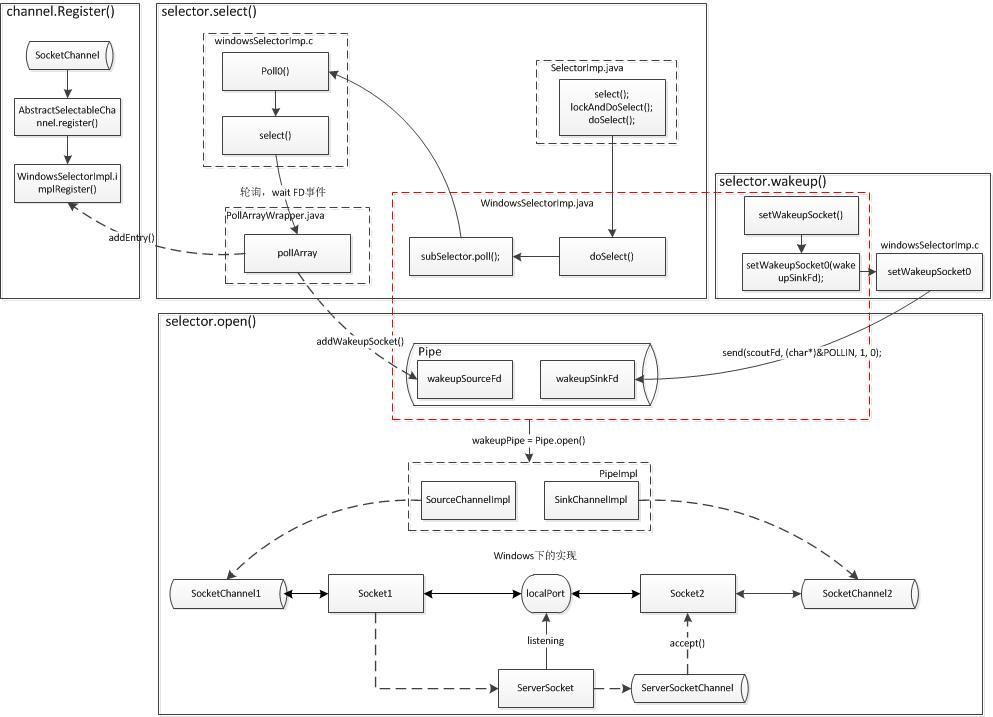

# Java NIO源码分析
距离上次看nio相关知识想来也快一年了，感觉对于nio的理解总是停留在IO复用的io模型，知其然但不知其所以然，故而今天来解开Java NIO的神秘面纱。

首先来回顾下NIO基本概念，Java NIO主要由Buffer、Channel、Selector三大组件组成。其他组件比如Pipe、FileLock只不过是这三个组件的公共工具类。

Buffer是与NIO Channel交互的载体，提供了一系列便于操作内存块的方法。读数据是从Channel读取到Buffer中，写数据是从Buffer写入到Channel。

使用Buffer进行读写数据通常需要4步：
1. 将数据写入到Buffer
2. 调用buffer.flip()
3. 从Buffer中读取数据
4. 调用buffer.clear()或者buffer.compact()


```java
/**
 * @author: shangyd
 * @create: 2019-04-03 14:58:18
 **/
public class WebServer {

    private WebServer() {

    }

    private static class WebServerHolder{
        private static WebServer server = new WebServer();
    }
    public static WebServer getInstance() {
        return WebServerHolder.server;
    }

    public void init() throws Exception {
        //打开一个选择器
        Selector selector = Selector.open();
        //打开ServerSocketChannel通道
        ServerSocketChannel ssc = ServerSocketChannel.open();
        //得到ServerSocket对象
        ServerSocket socket = ssc.socket();
        socket.bind(new InetSocketAddress(8089));
        socket.setReuseAddress(true);
        //设置通道为非阻塞
        ssc.configureBlocking(false);
        //将ServerSocketChannel注册给选择器，并绑定ACCEPT事件
        ssc.register(selector, SelectionKey.OP_ACCEPT);
        ExecutorService executor = Executors.newFixedThreadPool(Runtime.getRuntime().availableProcessors());
        while (selector.isOpen()) {
            //查询准备就绪的通道数
            int readyChannels = selector.select();
            //没有就绪通道则继续循环
            if (readyChannels == 0) {
                continue;
            }
            //获得就绪的SelectionKey的set集合
            Set<SelectionKey> selectionKeys = selector.selectedKeys();
            Iterator<SelectionKey> iterator = selectionKeys.iterator();
            while (iterator.hasNext()) {
                SelectionKey next = iterator.next();//安全删除原集合中的元素
                iterator.remove();
                try {
                    if (!next.isValid()) {//当前的key是否有效
                        continue;
                    } else if (next.isAcceptable()) {//ACCEPT事件
                        SocketChannel accept = ssc.accept();
                        accept.configureBlocking(false);
                        accept.register(selector, SelectionKey.OP_READ).attach(new Worker(accept));
                    } else if (next.isReadable()) {//Read事件
                        Worker worker = (Worker) next.attachment();
                        executor.execute(worker);
                    } else if (next.isWritable()) {//Write事件

                    }
                } catch (IOException e) {
                    e.printStackTrace();
                    System.err.println(next.channel());
                }
            }
        }
    }


    private static class Worker implements Runnable {
        private SocketChannel socketChannel;
        private ByteBuffer byteBuffer = ByteBuffer.allocateDirect(1024);

        public Worker(SocketChannel socketChannel) {
            this.socketChannel = socketChannel;
        }

        @Override
        public void run() {

            try {
                int read = socketChannel.read(byteBuffer);
                while (read > 0) {
                    byteBuffer.flip();
                    byte[] buf = new byte[byteBuffer.limit()];
                    byteBuffer.get(buf);
                    System.out.println(new String(buf));
                    byteBuffer.clear();
                    read = socketChannel.read(byteBuffer);
                }

                StringBuilder sb = new StringBuilder();
                sb.append("HTTP/1.1 200 ok").append("\n")
                        .append("Server: NIO WebServer By shangyd\n\n")
                        .append("<html><head><title>hello</title></head><body>hello world</body></html>");
                byteBuffer.put(sb.toString().getBytes());
                byteBuffer.flip();
                socketChannel.write(byteBuffer);
                byteBuffer.clear();
                socketChannel.close();
            } catch (IOException e) {
                e.printStackTrace();
            }
        }
    }

    public static void main(String[] args) {
        WebServer server = WebServer.getInstance();
        try {
            server.init();
        } catch (Exception e) {
            e.printStackTrace();
        }
    }
}

```

### Selector.open()
上面一段代码我们简单利用NIO实现了一个极简的web服务器，首先我们来看看`Selector selector = Selector.open()`选择器打开的背后秘密:

```java
 public static Selector open() throws IOException {
        return SelectorProvider.provider().openSelector();
 }
    
    public static SelectorProvider provider() {
        synchronized (lock) {
            if (provider != null)
                return provider;
            return AccessController.doPrivileged(
                new PrivilegedAction<SelectorProvider>() {
                    public SelectorProvider run() {
                            if (loadProviderFromProperty())//系统环境配置的SelectorProvider
                                return provider;
                            if (loadProviderAsService())//基于SPI机制配置的SelectorProvider
                                return provider;
                             //根据不同的操作系统返回不同的实现类
                            provider = sun.nio.ch.DefaultSelectorProvider.create();
                            return provider;
                        }
                    });
        }
    }
```

上面我们看到Selector是由SelectorProvider来提供，不同的操作系统会提供不同的SelectorProvider的实现，windows下的实现是`WindowsSelectorProvider`：
```java
//DefaultSelectorProvider
public static SelectorProvider create() {
        return new WindowsSelectorProvider();
}
//WindowsSelectorProvider
public AbstractSelector openSelector() throws IOException {
        return new WindowsSelectorImpl(this);
}
//WindowsSelectorImpl
private final int INIT_CAP = 8;//poll array的初始化容量
WindowsSelectorImpl(SelectorProvider sp) throws IOException {
        super(sp);
        pollWrapper = new PollArrayWrapper(INIT_CAP);
        wakeupPipe = Pipe.open();
        wakeupSourceFd = ((SelChImpl)wakeupPipe.source()).getFDVal();

        // Disable the Nagle algorithm so that the wakeup is more immediate
        SinkChannelImpl sink = (SinkChannelImpl)wakeupPipe.sink();
        (sink.sc).socket().setTcpNoDelay(true);
        wakeupSinkFd = ((SelChImpl)sink).getFDVal();

        pollWrapper.addWakeupSocket(wakeupSourceFd, 0);
    }
```

WindowsSelectorImpl的构造器中干了以下几件事儿：
+ 初始化PollArrayWrapper，调用Pipe.open() 打开一个管道
+ 获得wakeupSourceFd和wakeupSinkFd两个文件描述符
+ 将wakeupSourceFd放到pollWrapper中

这里Pipe.open()的目的是什么呢？
```java
//Pipe
/**
     * Opens a pipe.
     *
     * <p> The new pipe is created by invoking the {@link
     * java.nio.channels.spi.SelectorProvider#openPipe openPipe} method of the
     * system-wide default {@link java.nio.channels.spi.SelectorProvider}
     * object.  </p>
     *
     * @return  A new pipe
     *
     * @throws  IOException
     *          If an I/O error occurs
     */
    public static Pipe open() throws IOException {
        return SelectorProvider.provider().openPipe();
    }
 //SelectorProviderImpl
 public Pipe openPipe() throws IOException {
        return new PipeImpl(this);
 }
```
Pipe.open()最终调用的是`SelectorProvider.provider().openPipe()` 会获取对于操作系统的相关实现，这里看下windows的实现
```java
/**
 * A simple Pipe implementation based on a socket connection.
 */

class PipeImpl
    extends Pipe
{

    // Source and sink channels
    private SourceChannel source;
    private SinkChannel sink;

    // Random object for handshake values
    private static final Random rnd;

    static {
        byte[] someBytes = new byte[8];
        boolean resultOK = IOUtil.randomBytes(someBytes);
        if (resultOK) {
            rnd = new Random(ByteBuffer.wrap(someBytes).getLong());
        } else {
            rnd = new Random();
        }
    }

    private class Initializer
        implements PrivilegedExceptionAction<Void>
    {

        private final SelectorProvider sp;

        private IOException ioe = null;

        private Initializer(SelectorProvider sp) {
            this.sp = sp;
        }

        @Override
        public Void run() throws IOException {
            LoopbackConnector connector = new LoopbackConnector();
            connector.run();
            if (ioe instanceof ClosedByInterruptException) {
                ioe = null;
                Thread connThread = new Thread(connector) {
                    @Override
                    public void interrupt() {}
                };
                connThread.start();
                for (;;) {
                    try {
                        connThread.join();
                        break;
                    } catch (InterruptedException ex) {}
                }
                Thread.currentThread().interrupt();
            }

            if (ioe != null)
                throw new IOException("Unable to establish loopback connection", ioe);

            return null;
        }

        private class LoopbackConnector implements Runnable {

            @Override
            public void run() {
                ServerSocketChannel ssc = null;
                SocketChannel sc1 = null;
                SocketChannel sc2 = null;

                try {
                    // Loopback address
                    InetAddress lb = InetAddress.getByName("127.0.0.1");
                    assert(lb.isLoopbackAddress());
                    InetSocketAddress sa = null;
                    for(;;) {
                        // Bind ServerSocketChannel to a port on the loopback
                        // address
                        if (ssc == null || !ssc.isOpen()) {
                            ssc = ServerSocketChannel.open();
                            ssc.socket().bind(new InetSocketAddress(lb, 0));
                            sa = new InetSocketAddress(lb, ssc.socket().getLocalPort());
                        }

                        // Establish connection (assume connections are eagerly
                        // accepted)
                        sc1 = SocketChannel.open(sa);
                        ByteBuffer bb = ByteBuffer.allocate(8);
                        long secret = rnd.nextLong();
                        bb.putLong(secret).flip();
                        sc1.write(bb);

                        // Get a connection and verify it is legitimate
                        sc2 = ssc.accept();
                        bb.clear();
                        sc2.read(bb);
                        bb.rewind();
                        if (bb.getLong() == secret)
                            break;
                        sc2.close();
                        sc1.close();
                    }

                    // Create source and sink channels
                    source = new SourceChannelImpl(sp, sc1);
                    sink = new SinkChannelImpl(sp, sc2);
                } catch (IOException e) {
                    try {
                        if (sc1 != null)
                            sc1.close();
                        if (sc2 != null)
                            sc2.close();
                    } catch (IOException e2) {}
                    ioe = e;
                } finally {
                    try {
                        if (ssc != null)
                            ssc.close();
                    } catch (IOException e2) {}
                }
            }
        }
    }

    PipeImpl(final SelectorProvider sp) throws IOException {
        try {
            AccessController.doPrivileged(new Initializer(sp));
        } catch (PrivilegedActionException x) {
            throw (IOException)x.getCause();
        }
    }

    public SourceChannel source() {
        return source;
    }

    public SinkChannel sink() {
        return sink;
    }

}

```

PipeImpl的代码比较简单，windows下的pipe是一个loopback的tcp连接，实现是通过在本地开启两个SocketChannel分别为source端和sink端并相互连接（通过传输随机的Long值进行连接校验），前面提到这里的Source端将会被放到PollArrayWrapper中

```java
//PollArrayWrapper
//Manipulates a native array of structs corresponding to (fd, events) pairs.
private AllocatedNativeObject pollArray; // The fd array
@Native private static final short FD_OFFSET     = 0; // fd offset in pollfd
@Native private static final short EVENT_OFFSET  = 4; // events offset in pollfd
PollArrayWrapper(int newSize) {
        int allocationSize = newSize * SIZE_POLLFD;
        pollArray = new AllocatedNativeObject(allocationSize, true);
        pollArrayAddress = pollArray.address();
        this.size = newSize;
}
// Adds Windows wakeup socket at a given index.
void addWakeupSocket(int fdVal, int index) {
    putDescriptor(index, fdVal);
    putEventOps(index, POLLIN);//将Source端POLLIN事件标记为感兴趣
}
// Access methods for fd structures
void putDescriptor(int i, int fd) {
    pollArray.putInt(SIZE_POLLFD * i + FD_OFFSET, fd);
}
void putEventOps(int i, int event) {
    pollArray.putShort(SIZE_POLLFD * i + EVENT_OFFSET, (short)event);
}

```
`putEventOps(index,POLLIN)`将source端的POLLIN标记为感兴趣，当Sink端有数据写入时，Source端对应的wakeupSourceFd就会处于就绪状态。

存储Source端的对象为`AllocatedNativeObject`类型的`pollArray`,C中的对应结构为：
```c
typedef struct pollfd {
    SOCKET fd;            // 4 bytes
    short events;         // 2 bytes
 } pollfd_t;
```

对应Java的操作代码如下：
```
//AllocatedNativeObject
/**
 * Allocates a memory area of at least <tt>size</tt> bytes outside of the
 * Java heap and creates a native object for that area.
 *
 * @param  size
 *         Number of bytes to allocate
 *
 * @param  pageAligned
 *         If <tt>true</tt> then the area will be aligned on a hardware
 *         page boundary
 *
 * @throws OutOfMemoryError
 *         If the request cannot be satisfied
 */
AllocatedNativeObject(int size, boolean pageAligned) {
    super(size, pageAligned);
}
//AllocatedNativeObject
// Invoked only by AllocatedNativeObject
protected NativeObject(int size, boolean pageAligned) {
    if (!pageAligned) {
        this.allocationAddress = unsafe.allocateMemory(size);
        this.address = this.allocationAddress;
    } else {
        int ps = pageSize();
        long a = unsafe.allocateMemory(size + ps);
        this.allocationAddress = a;
        this.address = a + ps - (a & (ps - 1));
    }
}
```
上述代码可知`pollArray`利用unsafe.allocateMemory()开辟内存空间，按照`pollfd_t`的结构进行内存操作。

到这里分析完了整个Selector.open()的流程，主要是创建Pipe，然后将Pipe的wakeupSourceFd放到pollArray中，这个pollArray是Selector的枢纽。（windows是通过创建两个本地的SocketChannel然后互相连接来实现了Pipe，而Linux下直接使用的是系统的Pipe）

### ServerSocketChannel.register(selector,SelectionKey.OP_ACCEPT)

```java
//AbstractSelectableChannel
public final SelectionKey register(Selector sel, int ops, Object att) throws ClosedChannelException {
    synchronized (regLock) {
        if (!isOpen())
            throw new ClosedChannelException();
        if ((ops & ~validOps()) != 0)
            throw new IllegalArgumentException();
        if (blocking)
            throw new IllegalBlockingModeException();
        SelectionKey k = findKey(sel);
        if (k != null) {
            k.interestOps(ops);
            k.attach(att);
        }
        if (k == null) {
            // New registration
            synchronized (keyLock) {
                if (!isOpen())
                    throw new ClosedChannelException();
                k = ((AbstractSelector)sel).register(this, ops, att);
                addKey(k);
            }
        }
        return k;
    }
}

//SelectorImpl
protected final SelectionKey register(AbstractSelectableChannel ch,int ops,Object attachment){
    if (!(ch instanceof SelChImpl))
        throw new IllegalSelectorException();
    SelectionKeyImpl k = new SelectionKeyImpl((SelChImpl)ch, this);
    k.attach(attachment);
    synchronized (publicKeys) {
        implRegister(k);
    }
    k.interestOps(ops);
    return k;
}
//WindowsSelectorImpl
protected void implRegister(SelectionKeyImpl ski) {
    synchronized (closeLock) {
        if (pollWrapper == null)
            throw new ClosedSelectorException();
        growIfNeeded();
        channelArray[totalChannels] = ski;
        ski.setIndex(totalChannels);
        fdMap.put(ski);
        keys.add(ski);
        pollWrapper.addEntry(totalChannels, ski);
        totalChannels++;
    }
}

//PollArrayWrapper
// Prepare another pollfd struct for use.
void addEntry(int index, SelectionKeyImpl ski) {
    putDescriptor(index, ski.channel.getFDVal());
}
```
`ServerSocketChannel.register(selector,SelectionKey.OP_ACCEPT)`最终是将SocketChannel的文件描述符放到了`pollArray`中

### Selector.select()

```
//SelectorImpl
protected SelectorImpl(SelectorProvider var1) {
    super(var1);
    if (Util.atBugLevel("1.4")) {
        this.publicKeys = this.keys;
        this.publicSelectedKeys = this.selectedKeys;
    } else {
        this.publicKeys = Collections.unmodifiableSet(this.keys);
        this.publicSelectedKeys = Util.ungrowableSet(this.selectedKeys);
    }

}

public int select() throws IOException {
    return this.select(0L);
}

public int select(long timeout) throws IOException {
    if (timeout < 0)
        throw new IllegalArgumentException("Negative timeout");
    return lockAndDoSelect((timeout == 0) ? -1 : timeout);
}

private int lockAndDoSelect(long timeout) throws IOException {
    synchronized (this) {
        if (!isOpen())
            throw new ClosedSelectorException();
        synchronized (publicKeys) {
            synchronized (publicSelectedKeys) {
                return doSelect(timeout);
            }
        }
    }
}    


```


```
//WindowsSelectorImpl
protected int doSelect(long timeout) throws IOException {
    if (channelArray == null)
        throw new ClosedSelectorException();
    this.timeout = timeout; // set selector timeout
    processDeregisterQueue();
    if (interruptTriggered) {
        resetWakeupSocket();
        return 0;
    }
    // Calculate number of helper threads needed for poll. If necessary
    // threads are created here and start waiting on startLock
    adjustThreadsCount();
    finishLock.reset(); // reset finishLock
    // Wakeup helper threads, waiting on startLock, so they start polling.
    // Redundant threads will exit here after wakeup.
    startLock.startThreads();
    // do polling in the main thread. Main thread is responsible for
    // first MAX_SELECTABLE_FDS entries in pollArray.
    try {
        begin();
        try {
            subSelector.poll();
        } catch (IOException e) {
            finishLock.setException(e); // Save this exception
        }
        // Main thread is out of poll(). Wakeup others and wait for them
        if (threads.size() > 0)
            finishLock.waitForHelperThreads();
      } finally {
          end();
      }
    // Done with poll(). Set wakeupSocket to nonsignaled  for the next run.
    finishLock.checkForException();
    processDeregisterQueue();
    int updated = updateSelectedKeys();
    // Done with poll(). Set wakeupSocket to nonsignaled  for the next run.
    resetWakeupSocket();
    return updated;
}


```


```
//SubSelector
private int poll() throws IOException{ // poll for the main thread
        return poll0(pollWrapper.pollArrayAddress,
                     Math.min(totalChannels, MAX_SELECTABLE_FDS),
                     readFds, writeFds, exceptFds, timeout);
    }
private native int poll0(long pollAddress, int numfds,
             int[] readFds, int[] writeFds, int[] exceptFds, long timeout);
```


对应的C代码：

```
JNIEXPORT jint JNICALL
Java_sun_nio_ch_WindowsSelectorImpl_00024SubSelector_poll0(JNIEnv *env, jobject this,
                                   jlong pollAddress, jint numfds,
                                   jintArray returnReadFds, jintArray returnWriteFds,
                                   jintArray returnExceptFds, jlong timeout) {
//略... ...
    /* Set FD_SET structures required for select */
    for (i = 0; i < numfds; i++) {
        if (fds[i].events & sun_nio_ch_PollArrayWrapper_POLLIN) {
           readfds.fd_array[read_count] = fds[i].fd;
           read_count++;
        }
        if (fds[i].events & (sun_nio_ch_PollArrayWrapper_POLLOUT |
                             sun_nio_ch_PollArrayWrapper_POLLCONN)) {
           writefds.fd_array[write_count] = fds[i].fd;
           write_count++;
        }
        exceptfds.fd_array[except_count] = fds[i].fd;
        except_count++;
    }
//略 ... ...

    /* Call select */
    if ((result = select(0 , &readfds, &writefds, &exceptfds, tv))
                                                             == SOCKET_ERROR) {
        /* Bad error - this should not happen frequently */
        /* Iterate over sockets and call select() on each separately */
//略 ... ...
        for (i = 0; i < numfds; i++) {
//略 ... ...
            /* call select on the i-th socket */
            if (select(0, &errreadfds, &errwritefds, &errexceptfds, &zerotime)
                                                             == SOCKET_ERROR) {
               
            } 
  //略 ... ...
    }

```
上述native的代码，大概逻辑是整理出`pollArray`中的读写的socket描述符，然后调用c的select（即系统的sys_select调用），系统调用的原型如下：
```
int select(int nfds,fd_set *readfds,fd_set *writefds, fd_set *exceptfds,struct timeval *timeout);
参数含义：
1. nfds:fdset集合中最大描述符值加1，fdset是一个位数组，其大小限制为_FD_SETSIZE(1024),位数组的每一位代表其对应的描述符是否需要被检查，如果select是监听的概念，那这里表示监听对象的大小
2. readfds:文件描述符中需要被关注的读事件描述符数组，在调用过程中会被内核修改并返回，故每次调用select时，都需要重新初始化这些参数
3. writefds：被关注的文件描述符写事件，同readfds
4. exceptfds：被关注的文件描述符异常事件，同readfds
5. timeout：表示超时时间。每次系统调用之后，内核会修改这个值，将其设置为剩余多少时间
```
感兴趣的同学可以研究下select的内核实现。大体的逻辑是select会对每个set中的描述符进行轮询，如果有事件发生就将结果写入用户空间并返回；如果轮询一轮未发现任何事件发生时，若设置了超时时间，select会休眠到超时，睡眠结束后再进行一次轮询，有事件发生则写入用户空间并返回。这里select是轮询`pollArray`中的FD,如果有事件发生收集发生的事件FD，退出阻塞。

nio的select在不同的操作系统中的实现不同
```
/**
 *  DefaultSelectorProvider
 **/
//Windows
/**
 * Returns the default SelectorProvider.
 */
public static SelectorProvider create() {
    return new sun.nio.ch.WindowsSelectorProvider();
}
//Linux/SunOS
/**
 * Returns the default SelectorProvider.
 */
public static SelectorProvider create() {
    String osname = AccessController
        .doPrivileged(new GetPropertyAction("os.name"));
    if (osname.equals("SunOS"))
        return createProvider("sun.nio.ch.DevPollSelectorProvider");
    if (osname.equals("Linux"))
        return createProvider("sun.nio.ch.EPollSelectorProvider");
    return new sun.nio.ch.PollSelectorProvider();
}
//macosx
/**
 * Returns the default SelectorProvider.
 */
public static SelectorProvider create() {
    return new sun.nio.ch.KQueueSelectorProvider();
}
```
上述代码可以看到Linux下使用的`EPollSelectorProvider`(即epoll调用),select/poll和epoll的区别是进程通过将一个或多个fd传递给select/poll系统调用，阻塞在select，select/poll顺序帮我们监听fd是否就绪，支持的fd数量有限，时间复杂度为O(n)。而epoll是基于事件驱动的方式而不是顺序扫描，epoll是当事件就绪时通过回调的方式通知，时间复杂度为O(1)。如下是一张网络上的epoll的原理图:




### Selector.wakeup()
调用wakeup()可即可唤醒阻塞在select()上的线程，windows的实现如下
```
//WindowsSelectorImpl
public Selector wakeup() {
    synchronized (interruptLock) {
        if (!interruptTriggered) {
            setWakeupSocket();
            interruptTriggered = true;
        }
    }
    return this;
}
// Sets Windows wakeup socket to a signaled state.
private void setWakeupSocket() {
    setWakeupSocket0(wakeupSinkFd);
}
private native void setWakeupSocket0(int wakeupSinkFd);
```
可以看到最终是调用了一个JNI方法`private native void setWakeupSocket0(int wakeupSinkFd);` 其源码如下：
```
JNIEXPORT void JNICALL
Java_sun_nio_ch_WindowsSelectorImpl_setWakeupSocket0(JNIEnv *env, jclass this,
                                                jint scoutFd) {
    /* Write one byte into the pipe */
    const char byte = 1;
    send(scoutFd, &byte, 1, 0);
}
```
调用的wakeup()方法最终是通过`send(scoutFd, &byte, 1, 0);` 发送一个字节的数据给wakeupSinkFd，那么select监听的wakeupSourceFd就是就绪状态，从而让select()方法退出阻塞。so windows下的Pipe通过建立本地的loopback的作用就显而易见了，这也是Selector阻塞唤醒的原理。


总结：
借用网络中的一张图 来贯穿一下windows下Java NIO的实现逻辑：




